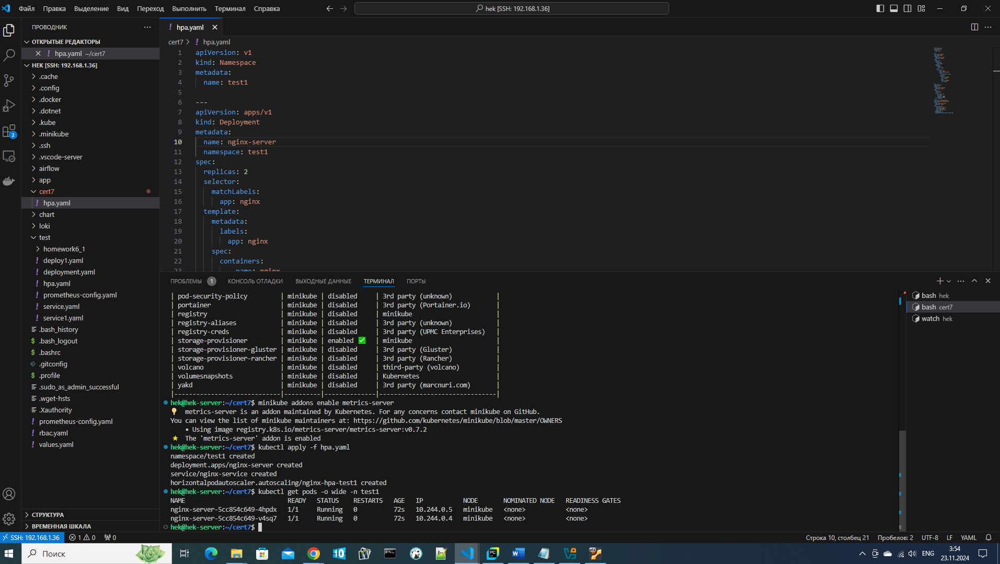
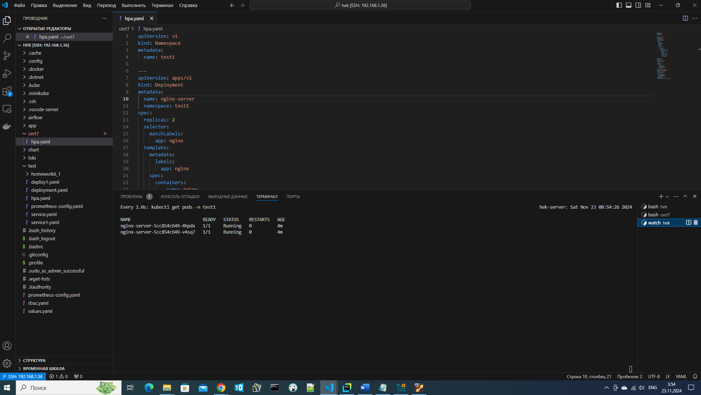
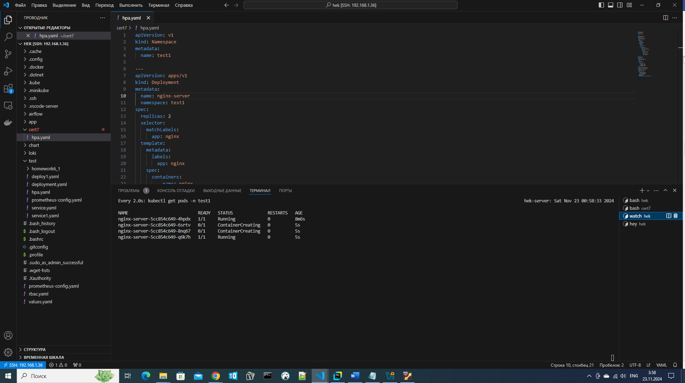
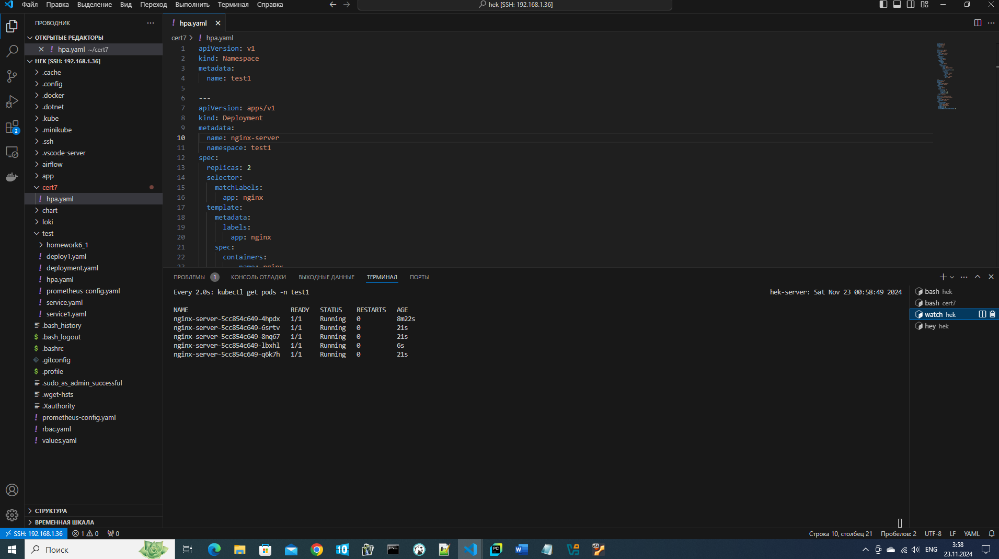
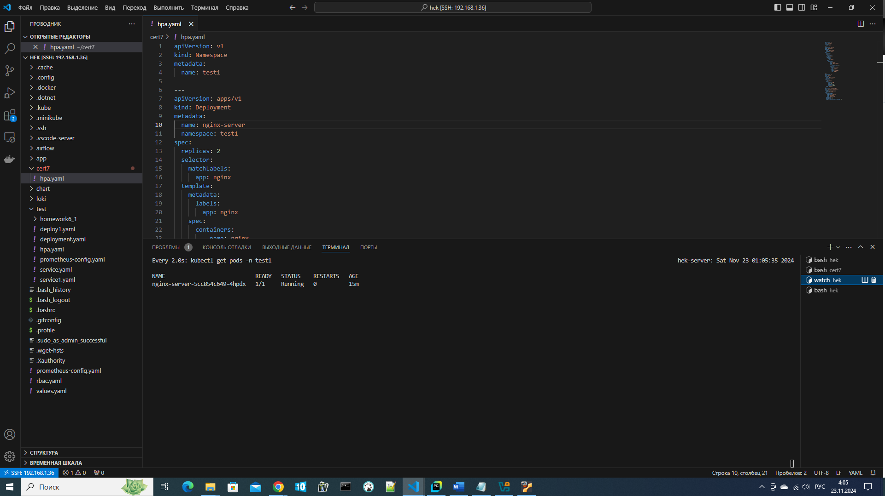

# certification 7 1T (DevOps)
## Задание 7. Автоматическое масштабирование приложения в Minikube с использованием HPA (Horizontal Pod Autoscaler)
### Настраиваем автоматическое горизонтальное масштабирование (HPA) приложения в Minikube на основе метрик нагрузки, таких как использование процессора (CPU)

Создаем директорию для проекта и файл hpa.yaml:
(В представленном манифесте создаём в namespace – test1: deployment – nginx (с 2 репликами и ограничениями по ресурсам), service - nginx-service и HPA с масштабированием до 5 подов)
```
apiVersion: v1
kind: Namespace
metadata:
  name: test1

--- 
apiVersion: apps/v1
kind: Deployment
metadata:
  name: nginx-server
  namespace: test1 
spec:
  replicas: 2
  selector:
    matchLabels:
      app: nginx
  template:
    metadata:
      labels:
        app: nginx
    spec:
      containers:
        - name: nginx
          image: nginx:latest
          ports:
            - containerPort: 80
          resources:
            requests:
              memory: "128Mi"
              cpu: "100m"
            limits:
              memory: "256Mi"
              cpu: "500m"

---
apiVersion: v1
kind: Service
metadata:
  name: nginx-service
  namespace: test1
spec:
  selector:
    app: nginx
  ports:
    - protocol: TCP 
      port: 80
      targetPort: 80
      nodePort: 30001
  type: NodePort
---
apiVersion: autoscaling/v1
kind: HorizontalPodAutoscaler
metadata:
  name: nginx-hpa-test1
  namespace: test1
spec:
  scaleTargetRef:
    apiVersion: apps/v1
    kind: Deployment
    name: nginx-server
  minReplicas: 1
  maxReplicas: 5
  targetCPUUtilizationPercentage: 50
```

Запускаем миникуб и создаем объекты в K8s из Манифест Файла kubectl apply -f hpa.yaml
```
kubectl apply -f hpa.yaml
```
Проверям работу подов
```
kubectl get pods -o wide -n test1
```


Далее устанавливаем hey и используем его для создания нагрузки
```
hey -n 100000000000 -c 100 http://192.168.58.2:30001
```

В отдельном терминале наблюдаем за работой HPA
```
watch kubectl get pods -n test1
```


Начала работать HPA


Все 5 подов запустились)))


Прекращаем нагружать сервер и ждем некоторе время....


HPA оставил 1 под, все отлично)))
